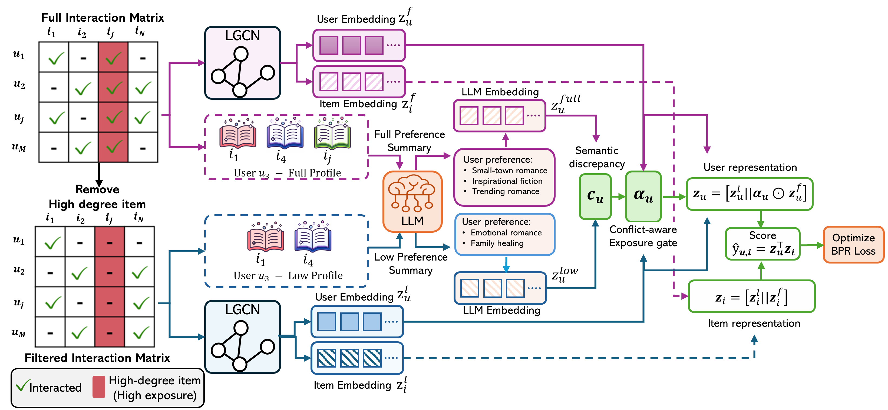

# SCOPE



## Usage

### 1. Generate Full and Low User Profiles

Run the following command to generate user profiles:

```bash
python src/bacth_gen.py -d dataset -o your_output_file_name
```

Replace `dataset` with one of the supported datasets:

```bash
book
movie
yelp
```

For example:

```bash
python src/batch_gen.py -d book -o book_user_profile
```

You should generate both full-profile and low-profile user files.

---

### 2. Convert Profiles to Embeddings

After generating the user profiles, convert them into embedding files:

```bash
python src/manual_fix.py -d dataset -i input_file_name -o output_file_name
```

For the full user profile, the output file should be named:

```bash
full_gema_user_feat.npy
```

For example:

```bash
python src/manual_fix.py -d movie -i movie_user_profile -o full_gema_user_feat.npy
```

Similarly, convert the low-profile user file into its corresponding embedding file. Make sure the output filename matches the name used in the configuration file.

---

### 3. Check Configuration Files

Before running SCOPE, check the corresponding configuration file under:

```bash
configs/dataset/movie.yaml
```

Make sure the configuration contains the correct names of the generated embedding files, including:

```bash
full_gema_user_feat.npy
local_gema_user_feat.npy
```

Also ensure that the low-profile embedding file name is correctly specified in the configuration.

---

### 4. Run SCOPE

Run the main training script:

```bash
python src/main.py -d dataset
```

For example:

```bash
python src/main.py -d movie
```

Supported datasets include:

```bash
book
movie
yelp
```

## Note

